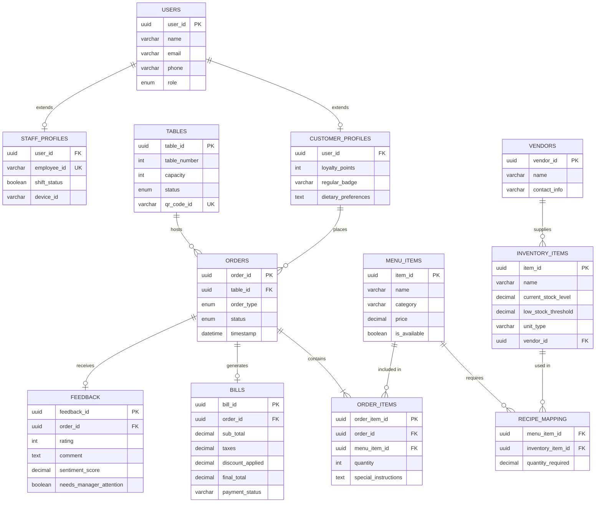

```mermaid
erDiagram
    %% Identity & Access Management
    USERS ||--o| STAFF_PROFILES : "extends"
    USERS ||--o| CUSTOMER_PROFILES : "extends"

    USERS {
        uuid user_id PK
        varchar name
        varchar email
        varchar phone
        enum role
    }
    STAFF_PROFILES {
        uuid user_id FK
        varchar employee_id UK
        boolean shift_status
        varchar device_id
    }
    CUSTOMER_PROFILES {
        uuid user_id FK
        int loyalty_points
        varchar regular_badge
        text dietary_preferences
    }

    %% Core Operations
    TABLES ||--o{ ORDERS : "hosts"
    CUSTOMER_PROFILES ||--o{ ORDERS : "places"
    ORDERS ||--|{ ORDER_ITEMS : "contains"
    
    TABLES {
        uuid table_id PK
        int table_number
        int capacity
        enum status
        varchar qr_code_id UK
    }
    ORDERS {
        uuid order_id PK
        uuid table_id FK
        enum order_type
        enum status
        datetime timestamp
    }
    ORDER_ITEMS {
        uuid order_item_id PK
        uuid order_id FK
        uuid menu_item_id FK
        int quantity
        text special_instructions
    }

    %% Inventory & Menu Engine
    MENU_ITEMS ||--o{ ORDER_ITEMS : "included in"
    MENU_ITEMS ||--o{ RECIPE_MAPPING : "requires"
    INVENTORY_ITEMS ||--o{ RECIPE_MAPPING : "used in"
    VENDORS ||--o{ INVENTORY_ITEMS : "supplies"

    MENU_ITEMS {
        uuid item_id PK
        varchar name
        varchar category
        decimal price
        boolean is_available
    }
    INVENTORY_ITEMS {
        uuid item_id PK
        varchar name
        decimal current_stock_level
        decimal low_stock_threshold
        varchar unit_type
        uuid vendor_id FK
    }
    RECIPE_MAPPING {
        uuid menu_item_id FK
        uuid inventory_item_id FK
        decimal quantity_required
    }
    VENDORS {
        uuid vendor_id PK
        varchar name
        varchar contact_info
    }

    %% AI Intelligence & Billing
    ORDERS ||--o| BILLS : "generates"
    ORDERS ||--o| FEEDBACK : "receives"

    BILLS {
        uuid bill_id PK
        uuid order_id FK
        decimal sub_total
        decimal taxes
        decimal discount_applied
        decimal final_total
        varchar payment_status
    }
    FEEDBACK {
        uuid feedback_id PK
        uuid order_id FK
        int rating
        text comment
        decimal sentiment_score
        boolean needs_manager_attention
    }
```
